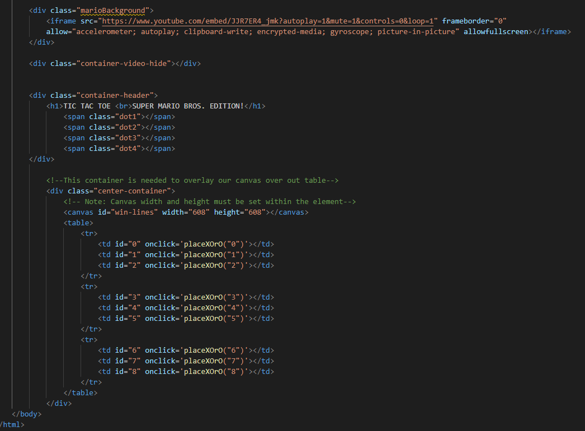
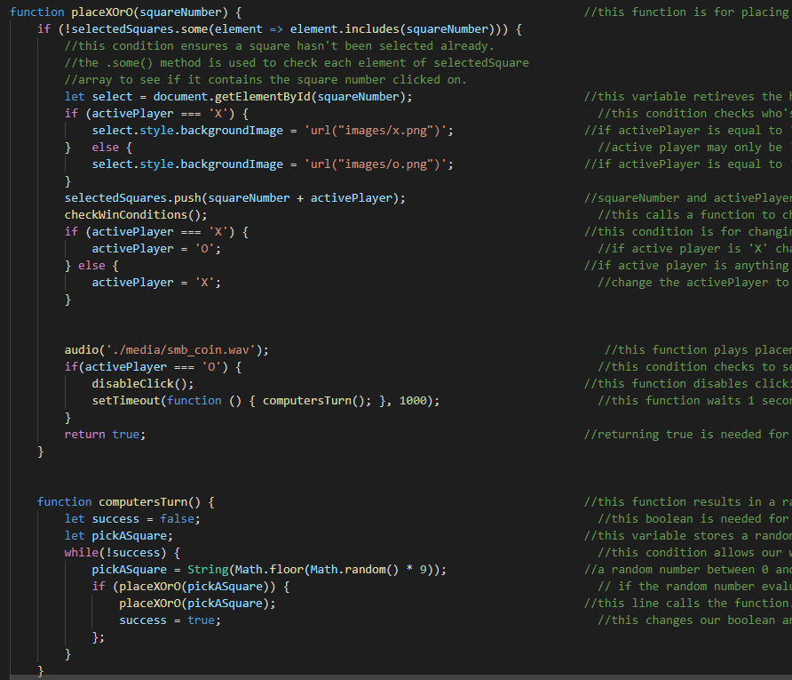
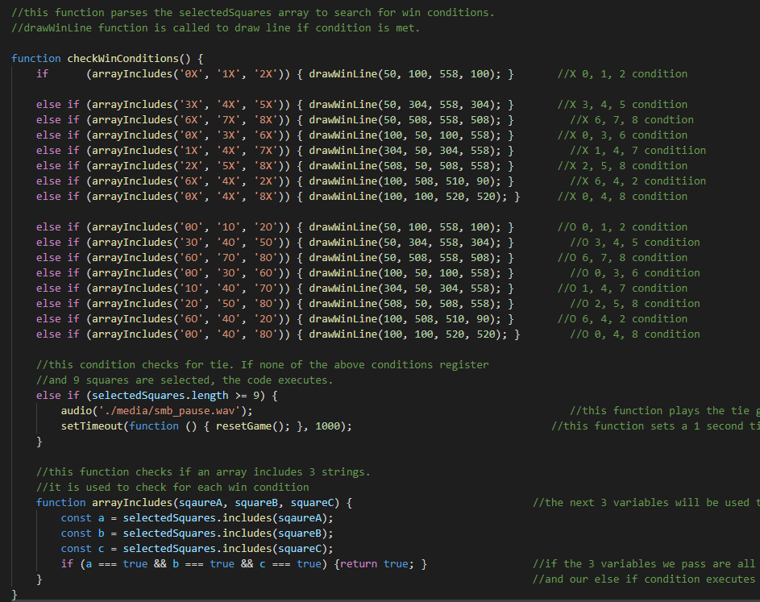
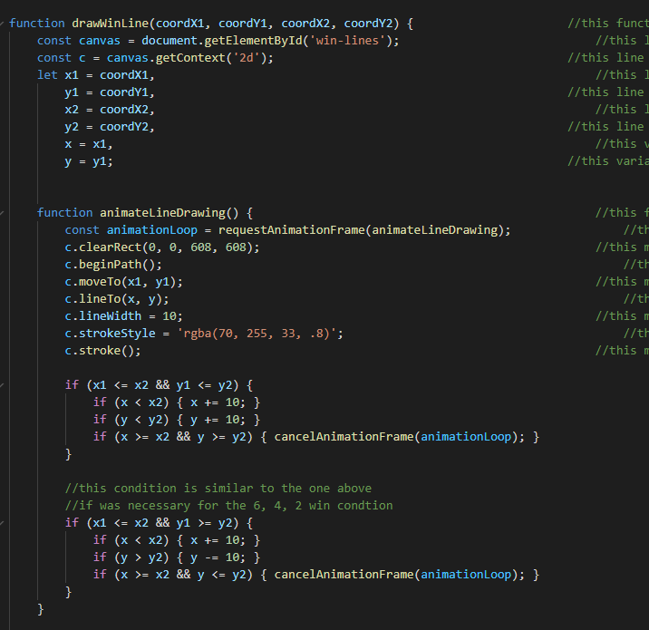
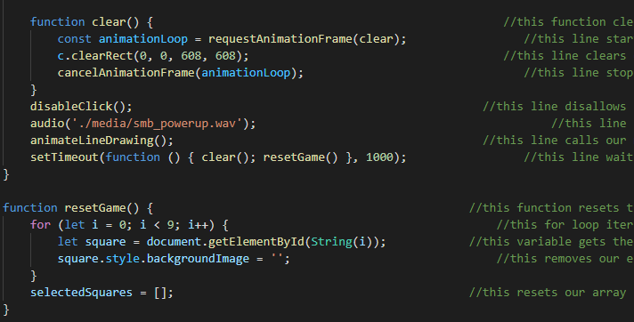

# Tic Tac Toe Super Mario Edition

 Web based Tic Tac Toe game used to demonstrate use of JavaScript
 
 Technologies used in creation:
 - JavaScript
 - HTML
 - CSS
 
 ## Index page
 I began by creating the index page and all of the table elements for the board
 
 
 
 ## Square Placement
 Next I wrote functions for placing a X or O and random selection from the computer opponent.
 This required declaring global variables for the active player which was assigned the value "X" and an empty array for storing each move made.
 Then came the function for the computers turn which used a while loop with the Math object.
 
 
 
 ## Check Win Conditions
 The next function uses an "if" statement to check win conditions. If conditions are met a line is drawn using the drawWinLine function (more on this below).
 
 
 
 ## Draw Win Line
 This function is used to draw a line using the HTML "canvas" element.
 
 

 ## Clear Board
 Finally a function is created to clear and reset the board after a game is complete.
 
 
